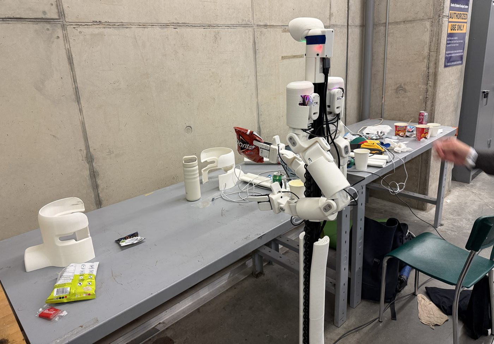
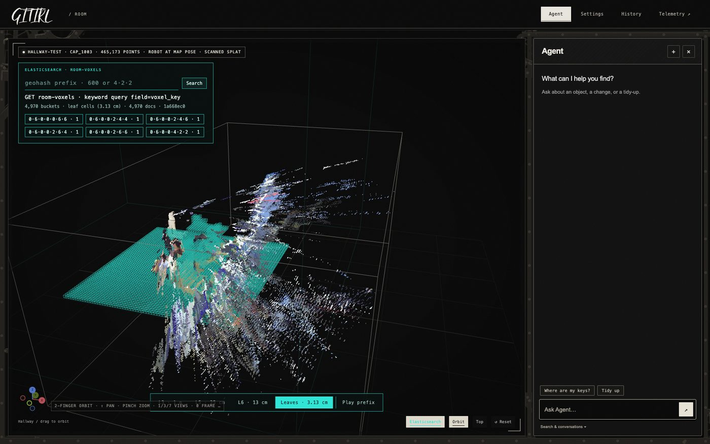
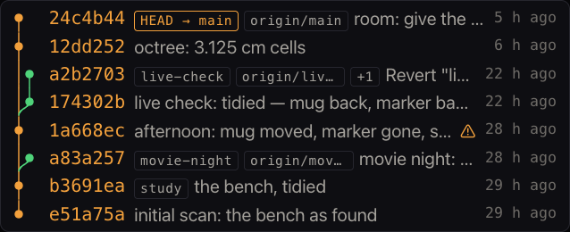
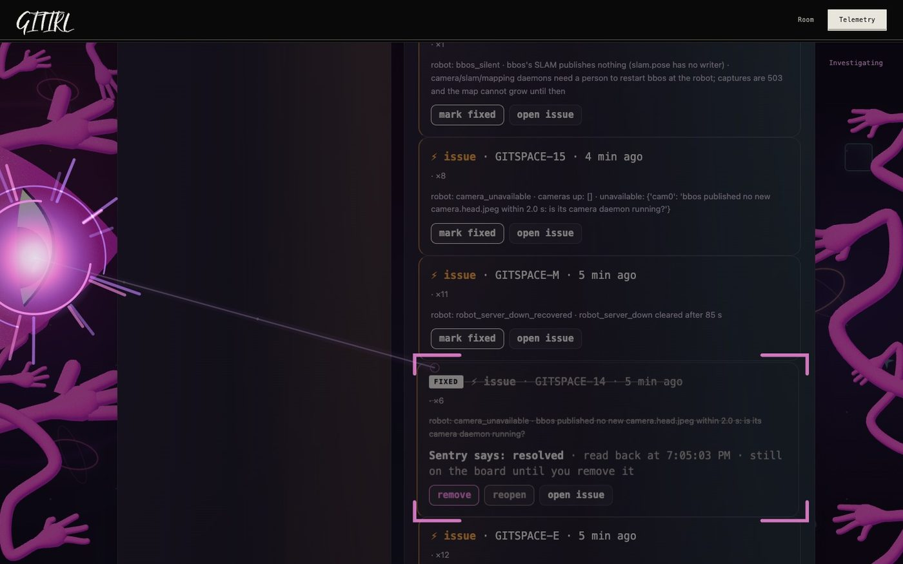
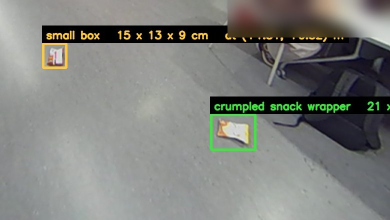

# GITIRL

[▶ Watch the demo](https://youtu.be/FEGR3mJmXMg)

**Version control for the room you are standing in.** The room is a git repository, and the robot
is `git apply` for physical reality.

> **Hack the North 2026** · Sep 18 to 20 · live at **https://gitirl.health**



```
world  --stereo cams + SLAM-->  point cloud  -->  objects  -->  YAML files  -->  a real git repo
  ^                                                                                     |
  '----  arm picks & places  <--  motion plan  <--  object diff  <--  git diff  <--------'
```

`git commit` records the room. `git status` is what has moved since. `git diff` prints a real diff
of physical space. An approved change is a real `--no-ff` merge; everything else is drift, and the
robot tidies drift, never decisions. Upstream of the robot it is *actual git*, not a re-implementation
([`docs/04-git-semantics.md`](docs/04-git-semantics.md)).

Git is the write path. **Elasticsearch is the read path**, because git cannot answer *"where did I
leave my keys"* or *"put it back the way it was two hours ago"*, and keeps nothing of the sensor
data we discard at commit time.

---

## The tracks

### Bracket Bot: best use of the hardware

The robot is not a camera on wheels here. It is the thing that *applies* the diff.

* We read **bbos's own fused SLAM map** (3 cm voxels) instead of rebuilding one, plus its pose and
  head camera, and we never restart its daemons, because that restarts a balancing base.
* **A capture is placed by the robot's own SLAM pose at the shutter**, so two scans from different
  spots land in one frame. A capture without a recorded pose says so rather than being drawn at the
  origin.
* **The caretaker loop**: two fresh passes confirm a change, then Tier A tidies it with the arm or
  Tier B drives up and files a chore, and a job counts as done only after a clean rescan.
* **The robot refuses.** No registration for this map generation, no motion. A stance at the very
  end of a placeholder reach, refused. An object the room no longer has, refused with where it went.
* Boot units bring the worker and the adapter back by themselves, proven on an unplanned reboot.
  `/healthz` carries the bus voltage and the count of its own dropped error reports.

### Elastic: find the signal

Everything a room cannot express in files lives in Elastic Cloud Serverless, one project, no
instances to manage.

* **Hybrid search** over every object the room has ever held: BM25 plus `jina-embed`, fused with
  RRF, reranked by `jina-rerank`, all inside Elastic. *"The thing I cut paper with"* finds the
  scissors; the cup ranks even though keyword search misses it entirely.
* **The octree** makes space queryable: a voxel key's prefix *is* a region, so zooming out is a
  keyword aggregation. 31,555 cells, rungs derived by an ingest pipeline.
* **ES|QL time travel**: *"put it back the way it was two hours ago"* resolves a phrase to the last
  commit strictly before that moment, and says whether Elastic or git found it.
* **The cross-index join** behind `room why <commit>`: a commit points at the capture that made it,
  which points at the telemetry in the seconds before the shutter, and every document carries the
  same Sentry trace id.
* **A vector search has no "not found"**, so we gave it one: measured floors, refuse the absurd, ask
  about the vague, act on the clear.
* **Search over the telemetry logs**, both halves: BM25 with highlighting over the event log, and
  ES|QL aggregation over the samples. *"tilt rejected capture"* returns the one real rejection with
  the threshold that tripped highlighted in it. The panel prints the query it ran beside the answer,
  and `took` is the cluster's own.
* 6.9M telemetry documents and counting. One `STATS` across all of them takes 29 ms.

### Sentry: best use

Seven products with real data, and the failures below were all found *by* them.

* **Tracing** from the laptop into the Pi over one trace, **profiling**, **logs**, **uptime**,
  **crons** (the room's clean badge), **session replay** including the WebGL canvas, and
  **AI agent monitoring** of the whole command path.
* **Seer** reads our traces and our repository together. `scripts/seer_sweep.py` works it through
  open issues on a hard budget, never applies a patch, and writes each root cause to
  [`docs/seer/`](docs/seer/). It named the file, the commit, and a fix we had already shipped.
* **What observability changed**: a 500 on the demo's own endpoint, found and fixed; keep-alive and
  a deeper queue after venue wifi cost 6 errors and 524 spans; 60 errors in a minute from a config
  parser keeping an inline comment inside an IP address; and paired failure/recovery events showing
  the robot *flapping* rather than simply down, which is a different diagnosis.
* Six issues in that list turned out to be filed by our own test suite. We resolved them and made it
  impossible: no suite anywhere can reach the live project now.

### Warp, Rox, OpenAI

One command runs the whole demo without hardware (`scripts/demo_sim.py`), the room answers in plain
language through a grammar first and a model second, and the model never writes a command: it fills
flat fields under a strict schema, we assemble and validate the result, and "unsure" is an answer.

## What it looks like

| | |
|---|---|
|  | **`/robot`** the room as the robot has it, with Elasticsearch's occupied cells drawn over the floor. Click a cell to drill into the region. |
|  | **The history**, drawn like an editor's git graph. An approved decision is a merge because that is what it is. |
|  | **`/telemetry`** the Sentry board. Marking an issue fixed really resolves it, read back before the page believes it. |
|  | **Floor objects.** A crisp packet is 4 cm tall against 6 cm of floor noise, so colour finds it where height cannot: 12 of 12 real items, 1 false, over twenty captures. |
|  | **What the robot sees.** A frame may name objects only when at least 60% of its standing pixels agree with the robot's map within 15 cm. Real frames score 67 to 85%; the same frame against a wrong heading scores 8 to 23%, and against a seven minute stale map, 43%. Reproduce any of it with `bbos_map.py frame-check`. |

## Run it

```bash
python -m venv .venv && .venv/bin/pip install -r web/requirements.txt
cp .env.example .env                      # Elastic, Sentry, OpenAI
cd web && ../.venv/bin/python server.py   # http://127.0.0.1:8000
python scripts/demo_sim.py up             # simulator, room, loop, and a site on :8001
.venv/bin/python -m pytest -q tests perception/tests web/tests bridge elastic/tests telemetry
```

About 1,130 tests. `scripts/gcp_mirror.sh ship` deploys the backend to GCP, `scripts/deploy_vercel.sh`
the front end. Code layout: `roomctl/` the room CLI, `perception/` scans and objects, `robot/` the Pi
worker and adapter, `bridge/` language and jobs, `web/` 14 routers and the pages, `elastic/` the
index and queries, `fake/` the simulator, `andrew/` a teammate's edge service copied unedited
([`andrew/PROVENANCE.md`](andrew/PROVENANCE.md)).

## Rules that are not negotiable

* **The robot moves only when a person asks for it in that moment**, with people beside it. No
  scheduler, no retry, no page dispatches motion on its own.
* **Never invent a number.** An unrecorded pose is reported as absent, not converted. A scan that
  saw nothing says so. A threshold is measured where it is enforced or it does not ship.
* **Nothing simulated is ever labelled real.** `simulated: true` comes from the answer, never assumed.
* **No test may reach the live Sentry project or the shared indices.**
* **Camera frames stay on the operator's machine** unless they publish them deliberately.

## Docs

Start with [`docs/01-concept.md`](docs/01-concept.md), then
[`docs/DEMO-RUNBOOK.md`](docs/DEMO-RUNBOOK.md), where every claim is either observed with the build
named, or marked not rehearsed. `docs/` also covers the hardware `02`, perception `03` `15` `20`,
git semantics `04`, the API `16`, Elastic `11` to `14`, Sentry `18` `26` `29`, deployment `19`,
camera sync `22`, telemetry `23`, traversal `24`, identity `25`, the robot link `33` `35`, and the
live room `34`. [`docs/10-open-questions.md`](docs/10-open-questions.md) is the decision log and
[`PROGRESS.md`](PROGRESS.md) the hour by hour record, including what surprised us.
